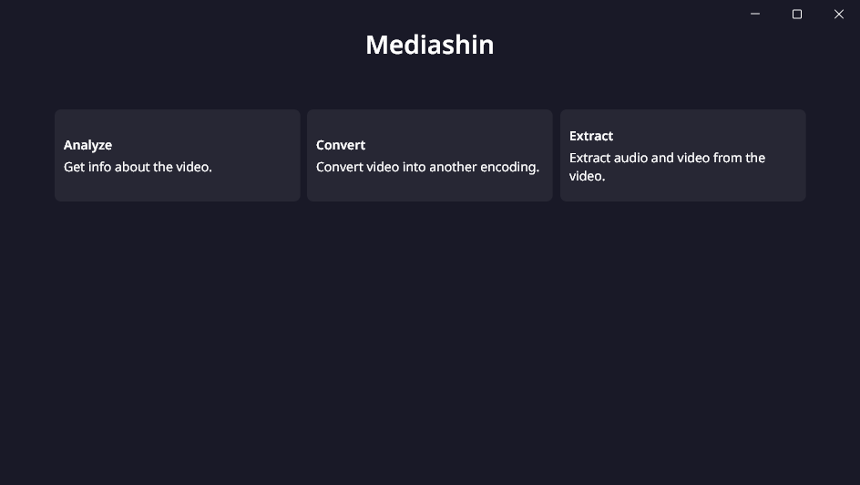
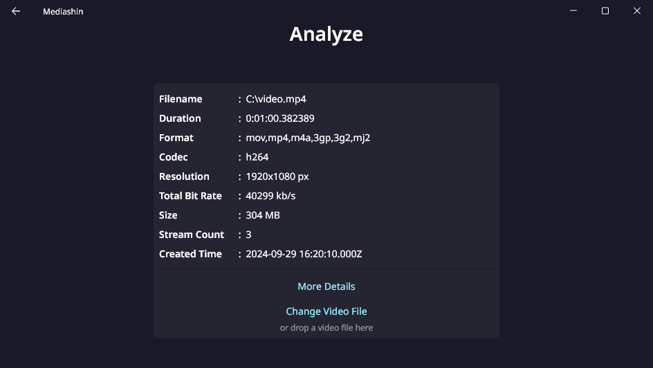

# Mediashin

Graphics User Interface of a few FFmpeg and FFprobe functions on Windows 10.

Inspired by my laziness on using CLI for FFmpeg or FFprobe everytime I need to check details, convert, or compress video files.

## App Preview

  

    <h2><code>[Click to show]</code> Tech Stack</h2>
  

### Services
1. [Flutter](https://flutter.dev/) v3.24.2 - Build, test, and deploy beautiful mobile, web, desktop, and embedded experiences from a single codebase.
1. [Dart](https://dart.dev/) v3.5.2 - An approachable, portable, and productive language for high-quality apps on any platform.
1. [FFmpeg](https://ffmpeg.org/) - A complete, cross-platform solution to record, convert and stream audio and video.

### Flutter Dependencies
1. [fluent_ui](https://pub.dev/packages/fluent_ui) - Unofficial implementation of Fluent UI for Flutter.
1. [window_manager](https://pub.dev/packages/window_manager) - This plugin allows Flutter desktop apps to resizing and repositioning the window.
1. [go_router](https://pub.dev/packages/go_router) - A declarative routing package for Flutter that uses the Router API to provide a convenient, url-based API for navigating between different screens.
1. [file_picker](https://pub.dev/packages/file_picker) - A package that allows you to use the native file explorer to pick single or multiple files, with extensions filtering support.
1. [process_run](https://pub.dev/packages/process_run) - Process run helpers for Linux/Win/Mac.
1. [path](https://pub.dev/packages/path) - A comprehensive, cross-platform path manipulation library for Dart.
1. [desktop_drop](https://pub.dev/packages/desktop_drop) - A plugin which allows user dragging files to your flutter desktop applications.
1. [mime](https://pub.dev/packages/mime) - Package for working with MIME type definitions and for processing streams of MIME multipart media types.

### License
License will be added soon. Until then, this project is not licensed for distribution or modification.
